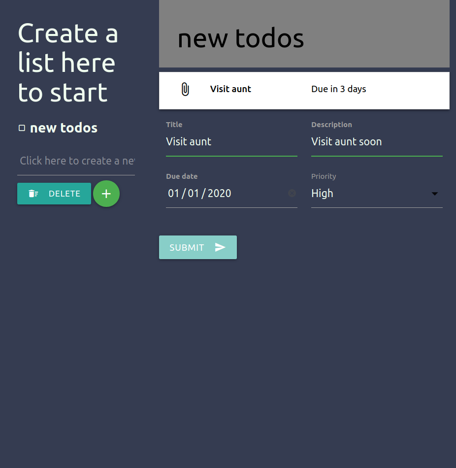

# To-do-list App

> In this project, we build a to-do-list app with various functionalities and using the date-fns npm module.



## Built With

- HTML, CSS, Javascript
- Webpack
- npm

## Linters used
- ESlint


## Live Demo

[Live Demo Link](https://onedebos.github.io/to-do-list/)

## Clone the project
```
git clone https://github.com/onedebos/to-do-list.git
```

## Install dependencies

```
npm install
```


## Authors

👤 **Adebola**

- Github: [@githubhandle](https://github.com/onedebos)
- Twitter: [@twitterhandle](https://twitter.com/debosthefirst)
- Linkedin: [linkedin](https://www.linkedin.com/in/adebola-niran/)

👤 **Diego**
- Github: [@digomes87](https://github.com/digomes87)
- Twitter: [@DevDiegoGo](https://twitter.com/DevDiegoGo)
- Linkedin: [linkedin](https://www.linkedin.com/in/diego-gomes-6b208384/)

## Show your support

Give a ⭐️ if you like this project!


## 📝 License

This project is [MIT](lic.url) licensed.
